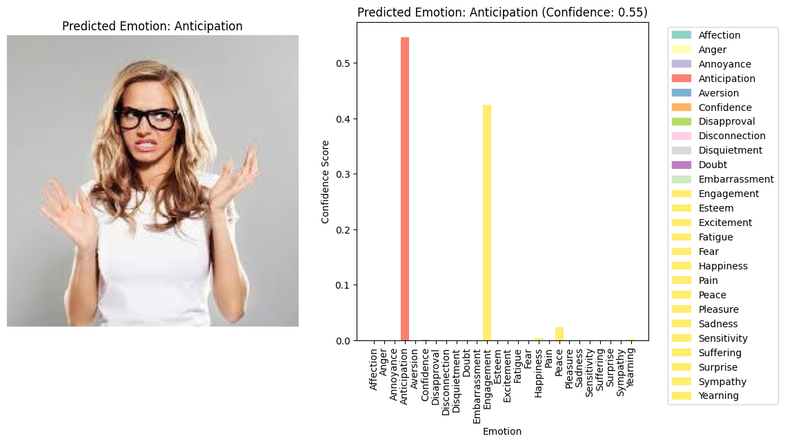

# Emotion Recognition Model using the Emotic Dataset
### Emotion Recognition Using ALEXNET Model with Adam Optimizer

 <!-- Replace with an appropriate header image -->

This repository contains a Jupyter Notebook that demonstrates the process of training an emotion recognition model using the ALEXNET architecture and the Adam optimizer. The model is trained on the Emotic dataset, which is a collection of images annotated with rich emotion labels.

## Table of Contents
- [Introduction](#introduction)
- [Dataset Preprocessing](#dataset-preprocessing)
- [Model Architecture](#model-architecture)
- [Training](#training)
- [Evaluation](#evaluation)
- [Co-Occurrence Matrix](#co-occurrence-matrix)
- [Image Prediction](#image-prediction)

## Introduction
This project focuses on building an emotion recognition model using ALEXNET architecture and the Adam optimizer. Emotion recognition is a valuable application in fields like user experience analysis, mental health support, and more.

## Dataset Preprocessing
The Emotic dataset is preprocessed and split into training, validation, and test sets. Data augmentation techniques are applied to improve model performance.

## Model Architecture
The ALEXNET architecture is defined in the notebook. It comprises several convolutional and fully connected layers, designed to extract meaningful features from images.

## Training
The model is trained using the Adam optimizer with a set number of epochs. The training process is detailed in the notebook.

## Evaluation
The trained model is evaluated on the validation set. Confusion matrices and classification reports are generated to assess its performance.

## Co-Occurrence Matrix
A co-occurrence matrix is created to analyze the relationships between predicted and true emotions. It provides insights into the model's performance across different emotion categories.

## Image Prediction
The trained model is used to predict emotions in sample images. The notebook showcases the predictions along with confidence scores.

Feel free to explore the notebook for a comprehensive understanding of the entire process.

## Credits
- ALEXNET architecture: [Original Paper](https://arxiv.org/ftp/arxiv/papers/1803/1803.01164.pdf)
- Emotic Dataset: [Dataset Link](https://github.com/Tandon-A/emotic)

## License
MIT License

Copyright (c) 2023 Karrtik Baheti

Permission is hereby granted, free of charge, to any person obtaining a copy
of this software and associated documentation files (the "Software"), to deal
in the Software without restriction, including without limitation the rights
to use, copy, modify, merge, publish, distribute, sublicense, and/or sell
copies of the Software, and to permit persons to whom the Software is
furnished to do so, subject to the following conditions:

The above copyright notice and this permission notice shall be included in all
copies or substantial portions of the Software.

THE SOFTWARE IS PROVIDED "AS IS", WITHOUT WARRANTY OF ANY KIND, EXPRESS OR
IMPLIED, INCLUDING BUT NOT LIMITED TO THE WARRANTIES OF MERCHANTABILITY,
FITNESS FOR A PARTICULAR PURPOSE AND NONINFRINGEMENT. IN NO EVENT SHALL THE
AUTHORS OR COPYRIGHT HOLDERS BE LIABLE FOR ANY CLAIM, DAMAGES OR OTHER
LIABILITY, WHETHER IN AN ACTION OF CONTRACT, TORT OR OTHERWISE, ARISING FROM,
OUT OF OR IN CONNECTION WITH THE SOFTWARE OR THE USE OR OTHER DEALINGS IN THE
SOFTWARE.

Welcome to the Emotion Recognition Model repository! This project showcases a state-of-the-art deep learning model trained on the Emotic dataset, a comprehensive collection of images and videos annotated with rich emotion labels.

Key Features:  

🧠 Trained on Emotic Dataset: Our model has been meticulously trained on the Emotic dataset, which contains diverse real-world images and videos, enabling it to understand a wide range of emotions and expressions.  

🌈 Multi-Modal Emotion Recognition: We have extended the model's capabilities to perform multimodal emotion recognition, allowing it to handle both images and video frames seamlessly and accurately.  

⚡ Easy Integration: The model comes with user-friendly APIs and examples that showcase how to integrate it into your projects effortlessly, whether you're working on a web application, mobile app, or research project.  

📊 Fine-Tuned Performance: Our model has been fine-tuned for high accuracy, achieving competitive results on benchmark emotion recognition tasks. Detailed performance metrics are available in the repository.

📚 Comprehensive Documentation: We believe in making AI accessible. That's why we provide extensive documentation, guiding you through model usage, integration, and even the process of retraining on specific domains if needed.  

💡 Endless Possibilities: Emotion recognition has applications across industries, from entertainment and marketing to mental health support. Explore the potential of our model and contribute to its enhancement.  

Get Involved: Want to contribute to the future of emotion recognition? This is a personal project and just a small glimpse of the work we’ve done in this field. We welcome your contributions, bug reports, and feature requests to help expand the capabilities of this model and make emotions more understandable for machines.

We aim to share the complete analysis and insights for a better understanding of the model's performance and its real-world applications. Join us in enhancing emotion recognition technology and pushing its boundaries.

Note: Remember to tailor the description according to the actual features and capabilities of your trained model and the Emotic dataset. This is just a template to give you an idea; feel free to personalize it further to match your project's unique attributes.
